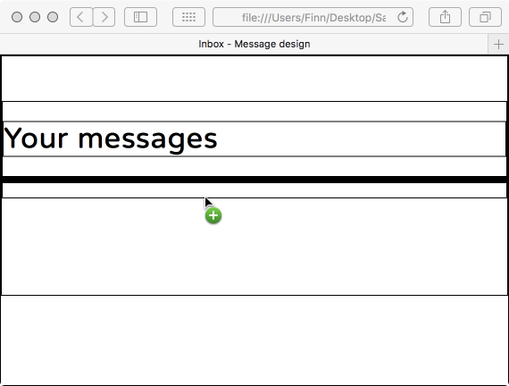
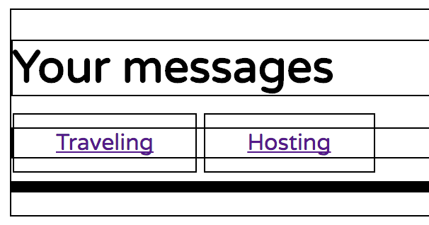

# Inbox

04-Front-End/02-CSS-components/03-Inbox


# Exercise 1 -  Inbox

## Our starting point


## Step 1 - Seeing our boxes

We start by inserting the follow lines in our header: (we will remove them later)

```html
<style>
  * {
    border: 1px solid black;
  }
</style>
````

```html
<html>
  <head>
    <meta charset="utf-8">
    <title>Inbox - Message design</title>
    <link ref="https://fonts.googleapis.com/css?family=Varela+Round" rel="stylesheet">
    <link href="http://maxcdn.bootstrapcdn.com/font-awesome/4.2.0/css/font-awesome.min.css" rel="stylesheet">
    <link rel="stylesheet" href="css/style.css">
    <style>
      * {
        border: 1px solid black;
      }
    </style>    
  </head>
```

You can press control + option + S to open Safari on the Mac and control + option + C to open Chrome. V should open Firefox. 

Now we have borders everywhere and we can see our boxes and divs. 



# Step 2 - Tabs

We need two tabs. For example "Traveling", "Hosting", but it could also be "Unread", "Read".

On the line 
```html
<!-- Code your tabs here -->
```

Tap Command + Enter. This should give you a new blank line just after it. 

We need a class "tabs" to contain both tabs and we need a class "tab" to target each tab.

Type the following and followed by a click on the Tab key. 
```html
.tabs>a.tab*2
```
This should unfold to this: 
```html
<div class="tabs">
  <a href="" class="tab"></a>
  <a href="" class="tab"></a>
</div>
```
Now give each tab a text and put a # as the link to the href attribute. 

Make sure it looks like this. 

```html
<div class="tabs">
  <a href="" class="tab">Traveling</a>
  <a href="" class="tab">Hosting</a>
</div>
```


We can see that our tabs are hyperlinks, since we would like to be able to click on them and make something happen. 

# Step 3 - Putting style on our Tabs

Start by adding the reference to the tabs and tab classes in the tabs.css file. 

```css
.tabs {

}

.tab {
  
}
```


We want out tabs to look like real tabs and thus to have some space around the text. We do this with padding. Here is a suggestion. 

```css
.tab {
  padding-top: 10px;
  padding-right: 30px;
  padding-bottom: 10px;
  padding-left: 30px;
}
```

*Note: We could have used a shorter version of padding, but I want you to see which values goes where and to make easy to change a specific value. For example, if you wanted to change the value of padding-bottom, it is easy to find.*



The result is a bit strange, since the div surrounding our two buttons has not taken the padding of the buttons into account. We do this by making the tabs div a flexbox.   

Make .tabs a flexbox by adding the following line to the .tabs style. 
```css
display: flex; 
```
*Note: You don't even need space-between or align-items here because the tabs already have the same height. We might remove the display: flex later.*

```css
.tabs {
  display: flex;
}

.tab {
  padding-top: 10px;
  padding-right: 30px;
  padding-bottom: 10px;
  padding-left: 30px;
}
```

Now it looks a bit better because the tabs div surrounds the buttons. 


Now let's get some background color on the tabs. One will be active, simulating that we have clicked on it and is looking on the corresponding emails. 

We need a way to see which one is active, so we add an active class to the first one.

```html
<div class="tabs">
  <a href="#" class="tab active">Traveling</a>
  <a href="#" class="tab">Hosting</a>
</div>
```

We add the corresponding selectors in the css file and at the same we will give the two tabs some background color using the below gray scale. 


```css
.tabs {
  display: flex;
}

.tab {
  padding-top: 10px;
  padding-right: 30px;
  padding-bottom: 10px;
  padding-left: 30px;
  background-color: rgb(162,162,162);
 }

.tab.active {
  background-color: rgb(87,87,87);
}
```


To remove the hyperlink look of the tab text, we add the following lines to the tabs selector. 
```css
  text-decoration: none;
  color: black;
```
And the following line to the active tab 
```css
  color: white;
```

```css
.tabs {
  display: flex;
}

.tab {
  padding-top: 10px;
  padding-right: 30px;
  padding-bottom: 10px;
  padding-left: 30px;
  background-color: rgb(162,162,162);
  text-decoration: none;
  color: black;
}

.tab.active {
  background-color: rgb(87,87,87);
  color: white;
}
```


We are now going to remove the border lines to see the result so far. 


From this point on it is decoration. Play around with opacity, colors, borders, margins. 

By adding some rounding to corners and some margin around the text, you get this. 

```css
  border-radius: 5px;
  margin: 5px;
```


To add a hover effect, add the following to your tabs.css file. 

```css
.tab:hover {
  background-color: rgb(150,150,150);
}
```

# Exercise 2 -  Messages

*To be written.*

When you do this part of the exercise, keep the boxes and aime for something like this. I hope this helps. Feedback is welcome. 


